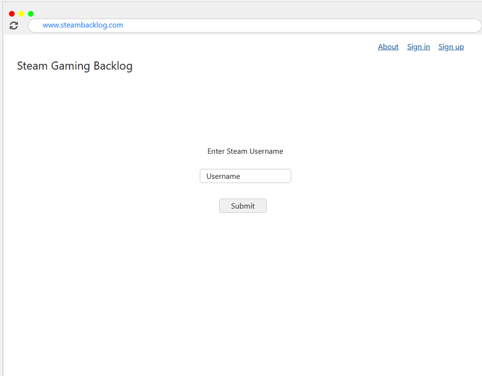
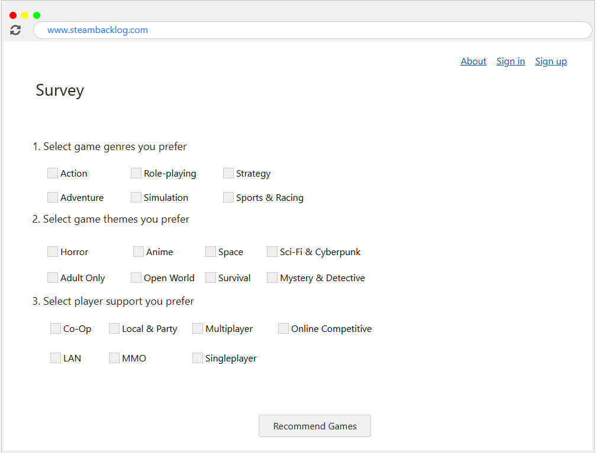
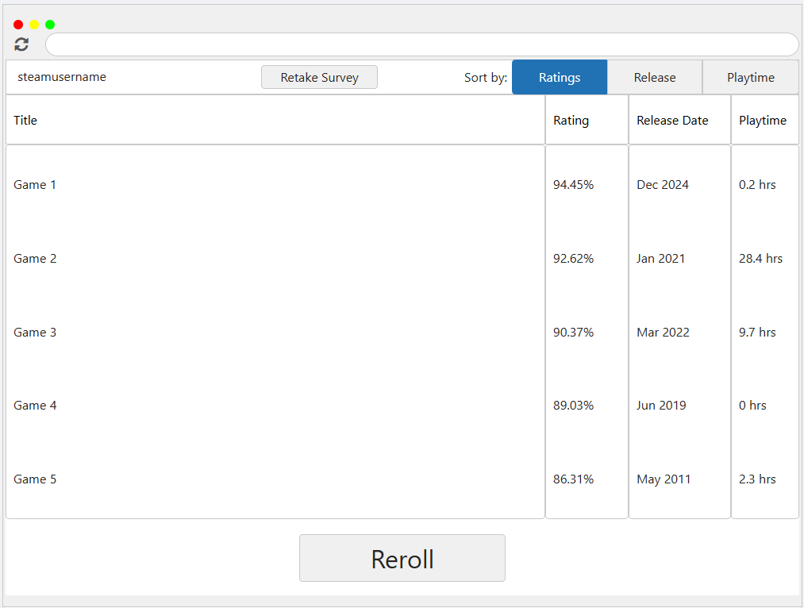

# Gaming Backlog Recommendation Generator App

## To Run Web App

```
Create config.js in project root containing the following:

module.exports = {
  apiKey: "YOUR_STEAM_API_KEY_HERE"
};


npm run start

```

## UI Mockups



<!--  -->



<!--  -->



## Tech stack

- Client-Server Architecture
- HTML
- JavaScript
- CSS
- Node.js
- Express.js

## Contributors

- Omar Ayesh
- Brian Blood
- Jake Galligan
- Jacky Liu
- Alexander Timmerman
